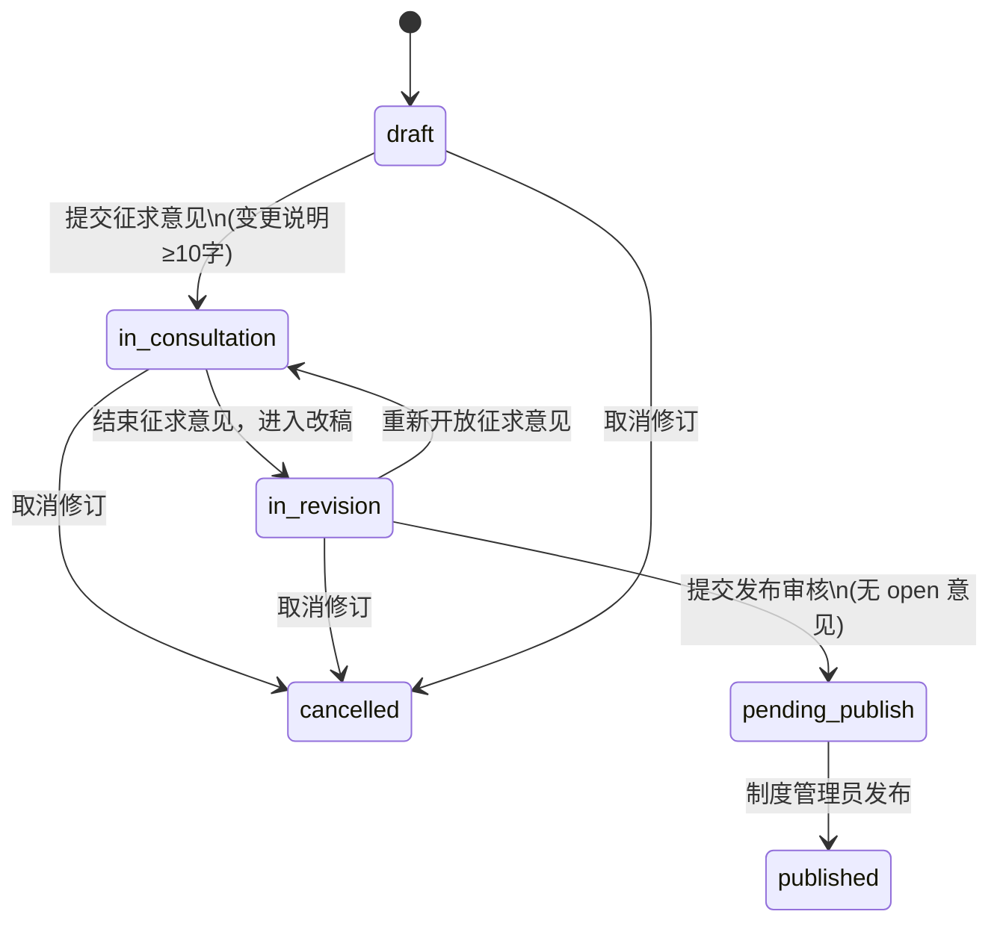

# 修订工作流与界面规格（UI/UX 补充）

> **状态:** 草案 · 2026-05-30  
> **关联:** [主设计规格](./2026-05-28-policy-revision-platform-design.md) §5  
> **目的:** 补齐原规格中缺失的「每阶段界面长什么样、如何衔接、谁做什么」——避免实现与试点使用时出现阶段混排、入口不清、权限与状态不一致等问题。

---

## 1. 为什么需要本文档

原规格 §5 只定义了**状态机名称**和**权限矩阵摘要**，未定义：

| 缺失项 | 导致的实际问题（试点已遇到） |
|--------|------------------------------|
| 每阶段独立页面 vs 单页混排 | 起草页与「征求意见」表单同时出现 |
| 阶段入口与导航 | 用户找不到 AI 草案 / 修订工作台 |
| 角色 × 阶段可见性 | owner 与 reviewer 看到相同按钮 |
| 状态切换后的跳转 | 提交征求意见后不知下一步去哪 |
| 正文加载/保存 | 编辑器显示本地占位内容，与 MinIO 草案不一致 |
| LLM 异步反馈 | 点击按钮「无反应」、Internal Server Error |
| 发布/审核界面 | 无「待发布」专页，admin 不知如何发布 |

本文档作为 **v1 界面与工作流的可执行说明**，并与当前代码实现对齐标注 **已实现 / 部分 / 未实现**。

---

## 2. 信息架构（页面地图）

```text
/login                          登录
/policies                       制度库（列表，无需登录读列表）
/policies/:id                   制度详情（元数据 + 修订任务列表 + 阶段入口）
/revisions/:id                  起草工作台（DRAFT / IN_REVISION 编辑；其他状态只读提示）
/revisions/:id/consultation     征求意见（仅 IN_CONSULTATION）
```

**v1 尚未实现的页面（应在 v1.1 补齐）：**

| 路由 | 用途 | 状态 |
|------|------|------|
| `/revisions/:id/publish` | 待发布审核（PENDING_PUBLISH） | 未实现 |
| `/revisions/:id/view` | 已发布只读快照（PUBLISHED） | 未实现 |
| `/admin/policies/new` | 新建制度 | 未实现（仅 API + seed） |

### 2.1 全局壳层（Layout）

所有登录后页面共有：

- 顶栏：**制度修订管理平台** | 制度库 | 退出登录
- 无全局「当前修订阶段」指示器（**建议 v1.1 增加**面包屑：制度库 › HR-001 › v2.0 起草）

---

## 3. 状态机与阶段衔接（总览）

### 3.1 状态与业务阶段对应

| 状态 `revision.state` | 业务阶段 | 主界面 | 次要界面 |
|----------------------|----------|--------|----------|
| `draft` | 起草 | 起草工作台 | — |
| `in_consultation` | 征求意见 | 征求意见页 | 起草工作台（只读提示） |
| `in_revision` | 按意见改稿 | 起草工作台 | — |
| `pending_publish` | 待发布审核 | （应有）发布页 | 制度详情 |
| `published` | 已发布 | 只读查看 | 制度详情 |
| `cancelled` | 已取消 | 只读 | — |

### 3.2 状态转移（经办人 Owner）



**后端门禁（已实现）：**

- 离开 `draft` → 非取消：`change_brief` 至少 10 字
- 进入 `pending_publish`：无 `open` 意见；`rejected`/`deferred` 须有 `resolution_note`
- `publish`：仅 `policy_admin`，且状态为 `pending_publish`

### 3.3 阶段衔接（用户动线）

```text
【Owner 典型路径】

制度库 → 制度详情 → 起草工作台
  → [编辑正文 / 生成 AI 初稿]
  → [提交征求意见] ──→ 通知评审人（v1.1）
  → 制度详情 / 征求意见页（查看进度，不可改稿）
  → [结束征求意见，进入改稿]
  → 起草工作台
  → [处理意见 / AI 改稿建议 / 编辑正文]
  → [提交发布审核]
  → （待发布页，v1.1）→ Admin 发布

【Reviewer 典型路径】

制度库 → 制度详情 → 征求意见（仅 in_consultation）
  → 只读正文 + 按章节提交意见
  → 完成（无后续操作，等 Owner 改稿）
```

---

## 4. 分阶段界面规格

### 4.1 阶段 A：`draft` 起草

**目标：** 归口部门完成初稿与变更说明，可调用 LLM 生成章节级建议。

#### 页面：`/revisions/:id` 起草工作台

| 区域 | 内容 | 角色 |
|------|------|------|
| 顶栏 | 标题「起草工作台」+ 状态徽章「草稿」+ 目标版本 | 所有人 |
| 阶段提示 | 蓝条：说明本阶段仅起草，征求意见在独立页面 | 所有人 |
| 主操作 | **提交征求意见**（Primary） | Owner |
| 修订说明 | 只读展示 `change_brief` | 所有人 |
| 工具栏 | **生成 AI 初稿**、刷新 AI 建议 | Owner |
| 正文区 | Markdown 全宽编辑器 | Owner 可编辑 |
| AI 建议列表 | 章节级 replace/insert/delete 建议 | Owner |
| **不得出现** | 征求意见表单、右侧意见栏 | — |

#### Owner 操作清单

| 操作 | API | 前置条件 |
|------|-----|----------|
| 编辑正文 | （v1.1）PUT draft markdown | 当前未实现，编辑器为本地状态 |
| 生成 AI 初稿 | POST `.../ai/draft` | 状态=draft；已配置 LLM |
| 刷新 AI 建议 | GET `.../ai/suggestions` | 已登录 |
| 提交征求意见 | POST `.../transition` → `in_consultation` | change_brief ≥ 10 字 |

#### Reviewer / Reader

- 可打开页面但**不可编辑**；显示提示「请使用经办人账号」。
- **不应**看到征求意见表单（已拆至独立页）。

#### 实现状态

| 项 | 状态 |
|----|------|
| 阶段 UI 分离 | ✅ 已实现 |
| 正文从 MinIO 加载 | ❌ 未实现 |
| 正文保存 | ❌ 未实现 |
| AI 初稿异步 + 进度 | ✅ 已实现（轮询 job） |
| 采纳 AI 建议 | ⚠️ API 有，UI 无按钮 |

---

### 4.2 阶段 B：`in_consultation` 征求意见

**目标：** 评审人对锁定正文按章节提意见；经办人不改稿。

#### 页面：`/revisions/:id/consultation` 征求意见

| 区域 | 内容 | 角色 |
|------|------|------|
| 顶栏 | 「征求意见」+ 状态徽章 | 所有人 |
| 导航 | 返回制度详情 · 起草工作台（只读入口） | 所有人 |
| 正文 | **只读** Markdown 预览 | 所有人 |
| 已提交意见 | 列表（section_id、状态、正文） | 所有人 |
| 提交意见表单 | 章节 ID + 意见内容 + 提交 | **仅 Reviewer** |

#### Owner 在本阶段

- **起草工作台** (`/revisions/:id`)：显示蓝条「当前处于征求意见，不可改稿」+ 链接到征求意见页。
- 主操作：**结束征求意见，进入改稿**、取消修订。
- **不**提交评审意见（权限矩阵：Owner ✗）。

#### Reviewer 操作清单

| 操作 | API | 前置条件 |
|------|-----|----------|
| 查看正文 | （v1.1）GET draft markdown | 当前为占位文案 |
| 提交意见 | POST `.../comments` | 状态=in_consultation |
| 修改/关闭意见 | PATCH comment | v1 API 有，UI 未做 |

#### 实现状态

| 项 | 状态 |
|----|------|
| 独立征求意见页 | ✅ 已实现 |
| 正文只读预览 | ⚠️ 占位，未拉 MinIO |
| 评审人专属表单 | ✅ 已实现 |
| 指定评审人/邀请 | ❌ 未实现 |
| 邮件/待办通知 | ❌ 未实现 |

---

### 4.3 阶段 C：`in_revision` 按意见改稿

**目标：** 经办人根据已收集意见修改正文，可用 LLM 针对意见生成改稿建议。

#### 页面：`/revisions/:id` 起草工作台（改稿模式）

| 区域 | 内容 | 角色 |
|------|------|------|
| 顶栏 | 「起草工作台」+ 徽章「修订中」 | 所有人 |
| 阶段提示 | 说明根据下方意见改稿 | Owner |
| 主操作 | **提交发布审核**、重新开放征求意见、取消 | Owner |
| 正文区 | Markdown 编辑器（全宽） | Owner |
| AI 建议 | 改稿建议（含意见触发的 patch） | Owner |
| 已收集意见 | 列表（**只读**，表单在下方全宽，非右侧栏） | 所有人 |
| **不得出现** | 新意见提交表单 | — |

#### Owner 操作清单

| 操作 | API | 说明 |
|------|-----|------|
| 编辑正文 | （v1.1） | 同 draft |
| 对单条意见触发 AI 改稿 | POST comment patch job | API 有，UI 未做 |
| 处理意见（采纳/驳回/暂缓） | PATCH comment | API 有，UI 未做 |
| 提交发布审核 | transition → `pending_publish` | 门禁：无 open 意见 |
| 第二轮征求意见 | transition → `in_consultation` | 已实现按钮 |

---

### 4.4 阶段 D：`pending_publish` 待发布

**目标：** 制度管理员复核并发布 PDF，生成新版本。

#### 应有页面（v1.1）：`/revisions/:id/publish`

| 区域 | 内容 | 角色 |
|------|------|------|
| 正文预览 | 最终稿只读 | Admin / Owner 只读 |
| 意见处理摘要 | 全部已关闭 | Admin |
| 操作 | 生成 PDF、确认发布 | **policy_admin** |

#### 当前 v1 实现

- 起草工作台进入 `readonly` 模式，仅一句「不可编辑」。
- 发布需调 API：`POST /api/revisions/:id/publish`（**无 UI**）。
- PDF 预生成：`POST .../publish-request`（**无 UI**）。

---

### 4.5 阶段 E：`published` / `cancelled`

- 制度详情展示当前版本；修订任务列表中状态徽章。
- 应有只读页查看该次修订快照（MD/PDF 链接）—— **未实现**。

---

## 5. 制度详情页：阶段入口枢纽

**页面：** `/policies/:id`

| 区块 | 内容 |
|------|------|
| 元数据 | 编码、归口部门、分类、当前版本 ID |
| 快捷入口 | 当前草稿修订 → **起草工作台（vX.X）** |
| 修订任务表 | 目标版本、状态、修订说明、操作 |

**操作列规则：**

| 修订状态 | 按钮 |
|----------|------|
| `draft` / `in_revision` | 起草工作台 |
| `in_consultation` | 起草工作台 + **征求意见** |
| `pending_publish` | （应有）发布审核 |
| `published` | 查看 |

**实现状态：** ✅ 基本已实现；待发布/已发布入口缺失。

---

## 6. 角色 × 阶段权限矩阵（UI 层）

| 阶段 | Owner | Reviewer | Policy admin |
|------|-------|----------|--------------|
| draft | 编辑、AI 初稿、提交征求意见 | 只读 | 只读 |
| in_consultation | 结束征求、不可改稿 | **提交意见** | 只读 |
| in_revision | 编辑、AI 改稿、提交发布 | 只读 | 只读 |
| pending_publish | 只读 | 只读 | **发布** |
| published | 只读 | 只读 | 只读 |

---

## 7. 试点问题根因对照表

| 现象 | 根因 | 规格缺口 | 修复方向 |
|------|------|----------|----------|
| 起草页右侧有征求意见 | v1 初版单页混排 | 未规定分阶段布局 | ✅ 已拆页 |
| 找不到 AI 草案 | 无修订任务入口 | 未规定制度详情→修订链接 | ✅ 已加表 |
| 无效的认证凭据 | JWT 与 seed 不一致 | 未规定 token 失效 UX | ✅ 401 跳转登录 |
| 生成 AI 无反馈 | 异步 job + 错误吞掉 | 未规定 LLM 异步 UX | ✅ 轮询 + 错误展示 |
| Request timed out | LLM 未配置/网关不通 | 未规定 dev mock | ✅ dev mock + .env 说明 |
| 编辑器内容与制度不符 | 未接 draft GET API | 未规定正文加载时机 | v1.1 PUT/GET draft |
| Internal Server Error | job 反序列化 bug | — | ✅ 已修 |
| 阶段按钮不知下一步 | 无动线说明 | 本文档 §3.3 | v1.1 转移后自动跳转 |

---

## 8. v1.1 界面 backlog（按优先级）

1. **P0** — GET/PUT `/revisions/:id/draft-markdown`：编辑器与 MinIO 同步  
2. **P0** — 待发布页 + Admin 发布按钮（含 PDF 预览）  
3. **P1** — 改稿阶段：意见处理（采纳/驳回/暂缓）+ 单条 AI patch 按钮  
4. **P1** — 采纳 AI 建议写入正文（UI 接已有 accept API）  
5. **P1** — 状态转移后引导（如提交征求 →  toast + 链接给 reviewer）  
6. **P2** — 指定评审人、Mandatory 标记、发布门禁 UI 提示  
7. **P2** — 面包屑、待办中心、邮件通知  

---

## 9. 验收清单（每阶段 smoke test）

### draft

- [ ] Owner 登录，起草工作台**无**意见表单  
- [ ] 生成 AI 初稿后有建议列表或明确错误  
- [ ] 变更说明不足 10 字时无法提交征求意见  

### in_consultation

- [ ] Reviewer 在**征求意见页**可提交意见  
- [ ] Owner 在起草工作台不可编辑  
- [ ] Owner 可「结束征求意见，进入改稿」  

### in_revision

- [ ] Owner 可编辑，下方见已收集意见  
- [ ] 存在 open 意见时无法提交发布审核  

### pending_publish

- [ ] Admin 可发布（v1.1 UI）  
- [ ] 发布后制度详情 current_version 更新  

---

## 10. 与主规格的关系

- 主规格 §5 状态机、权限、门禁 **仍然有效**。  
- **本文档不替代**主规格，而是补充 **UI 路由、布局、动线、实现差距**。  
- 新功能开发前应先更新本文档对应章节，再改代码（避免再次混排）。  

---

## 11. 变更记录

| 日期 | 说明 |
|------|------|
| 2026-05-30 | 初稿：分阶段 UI、动线、试点问题对照、v1.1 backlog |
